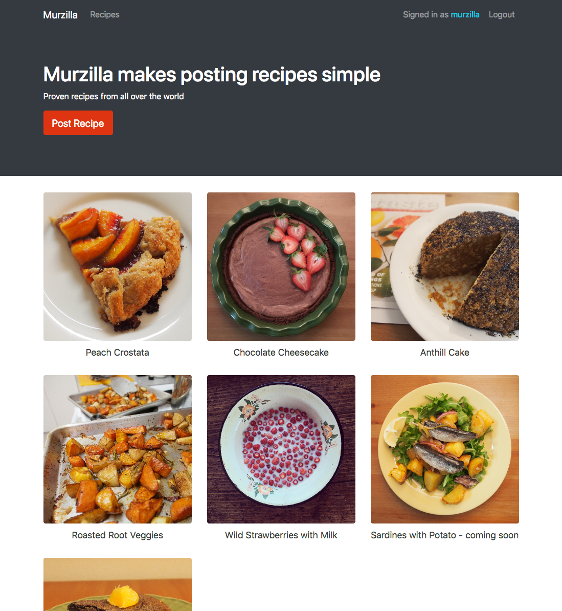
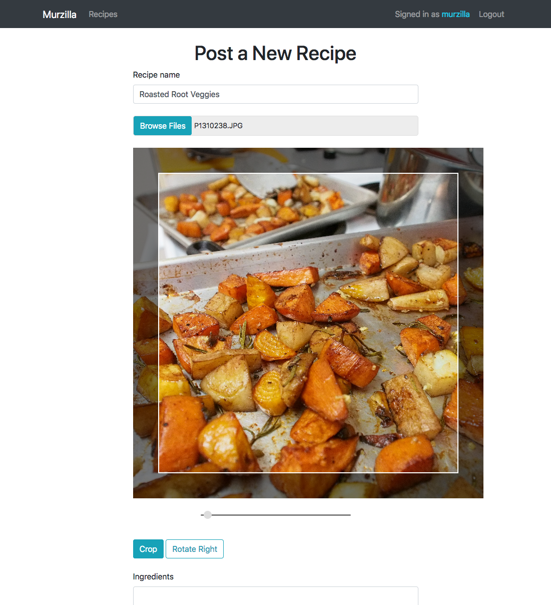

# Murzilla
Web application for sharing recipes http://murzilla.com

# Features
* browse existing recipes
* create an account
* upload/edit/delete a recipe
* edit recipe image: rotate, crop
* add/edit/delete a comment
* mobile-friendly

# UI

##

# Technologies
## Front-End
* HTML/EJS/CSS/Bootstrap
* JavaScript
* a little bit of React
## Back-End
* JavaScript, Node.js, Express
* MongoDB

Hosted on Google Cloud Platform
